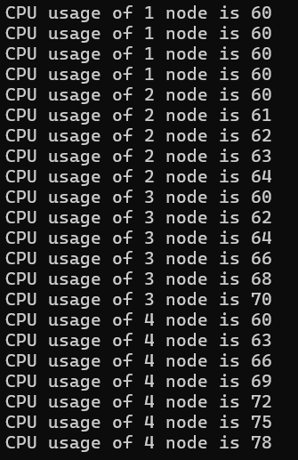

# Exp04-Jagged-Array
## Aim:
To write a C# program to create a sample CPU usage on a network with 4 nodes using a jagged array.
## Algorithm:
## Step 1:
Start the program.
## Step 2:
Initialize the jagged array with four single dimensional array.
## Step 3:
Define the size of each single dimesional array.
## Step 4:
Calculate the CPU usage using nested for loop.
## Step 5:
Print the output using Console.WriteLine().
## Step 6:
Execute the program.
## Program:
```
using System;
public class Pattern
{
    public static void Main()
    {
      int i,usage;
      int[][] jaggedArray = new int[4][];
        jaggedArray[0]=new int[4];
        jaggedArray[1]=new int[5];
        jaggedArray[2]=new int[6];
        jaggedArray[3]=new int[7];
      
      for(i=0;i<jaggedArray.Length;i++)
      {
        for(int j=0;j<jaggedArray[i].Length;j++)
        {
          usage=i*j+60;
           Console.WriteLine("CPU usage of {0} node is {1}", i + 1, usage);
        }
      }
      
    }
}
```
## Output:

## Result:
Thus,a C# program to create a sample CPU usage on a network with 4 nodes using a jagged array is successfully executed.